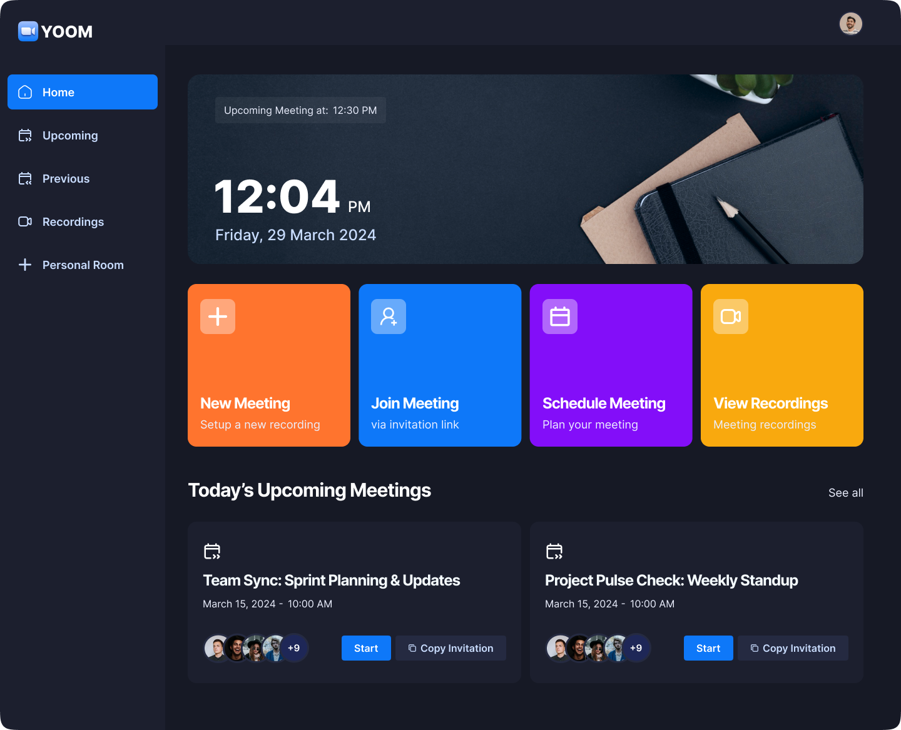

# Yoom — Modern Video Conferencing App


<!--  -->
### 🧑‍💻 Meeting Interface


### 🧑‍💻 Project Over view
A fully functional **Zoom Clone** name **YOOM** built with **Next.js 14**, **TypeScript**, and **Stream Video SDK**.
Yoom enables users to host and join real-time meetings with high-quality video, audio, screen sharing, scheduling, recording, and playback support.

---
## Overview

Yoom is a modern video conferencing platform designed to provide a seamless communication experience with all the essential features of a professional meeting app.
It combines a scalable architecture, clean design, and production-ready integrations like **Stream** and **Clerk** for authentication.

---

## Key Features

- 🎥 **HD Video & Audio Calls** — Real-time communication powered by Stream SDK
- 🖥️ **Screen Sharing** — Share your entire screen or a specific application
- 🎙️ **Mute / Unmute Controls** — Manage your mic with a single click
- 💾 **Recording & Playback** — Record sessions and replay them anytime
- 📡 **Live Meeting View** — Low-latency streaming of ongoing meetings
- 📅 **Meeting Scheduler** — Schedule meetings with custom titles, dates, and times
- 🔒 **Personal Rooms** — Create and manage persistent personal meeting rooms
- 🧑‍💻 **Authentication & User Profiles** — Secure user sign-in via Clerk
- 🧭 **Responsive Layout** — Optimized for all screen sizes and devices

---

## Tech Stack

| Category | Technology |
|-----------|-------------|
| Framework | [Next.js 14 (App Router)](https://nextjs.org) |
| Language | [TypeScript](https://www.typescriptlang.org/) |
| UI | [Tailwind CSS](https://tailwindcss.com/) + [shadcn/ui](https://ui.shadcn.com/) |
| Video SDK | [Stream Video React SDK](https://getstream.io/video/) |
| Authentication | [Clerk](https://clerk.com/) |
| Deployment | [Vercel](https://vercel.com/) |

---


## 📂 Project Structure

```bash
.
├── actions
│   └── stream.actions.ts
├── app
│   ├── (auth)
│   │   ├── sign-in
│   │   └── sign-up
│   ├── (root)
│   │   ├── (home)
│   │   ├── layout.tsx
│   │   └── meeting
│   ├── globals.css
│   └── layout.tsx
├── bun.lock
├── components
│   ├── EndCallButton.tsx
│   ├── HomeCard.tsx
│   ├── Loader.tsx
│   ├── MeetingModal.tsx
│   ├── MeetingRoom.tsx
│   ├── MeetingSetup.tsx
│   ├── MeetingTypeList.tsx
│   ├── MobileNav.tsx
│   ├── NavBar.tsx
│   ├── SideBar.tsx
│   └── ui
│       ├── button.tsx
│       ├── dialog.tsx
│       ├── dropdown-menu.tsx
│       ├── sheet.tsx
│       └── textarea.tsx
├── components.json
├── constants
│   └── index.ts
├── eslint.config.mjs
├── hooks
│   └── useGetCallById.tsx
├── lib
│   └── utils.ts
├── middleware.ts
├── next-env.d.ts
├── next.config.ts
├── package-lock.json
├── package.json
├── postcss.config.mjs
├── providers
│   └── StreamClientProvider.tsx
├── README.md
├── store
│   └── loader.store.ts
├── structure.txt
└── tsconfig.json


